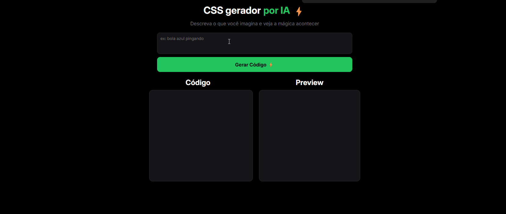

# 🚀 Gerador de Código HTML e CSS

<p align="center">
  Gere códigos HTML e CSS automaticamente de forma rápida e prática.
</p>

---

## 📸 Demonstração


  


---

## 💡 Sobre o projeto

Este projeto foi desenvolvido com o objetivo de praticar **JavaScript** e integrar o uso de **Inteligência Artificial** na geração automática de código.

A proposta é simples: o usuário descreve o que deseja e o sistema gera o HTML e CSS correspondentes, facilitando estudos, testes e prototipagem.

---

## 🛠️ Tecnologias utilizadas

* HTML5
* CSS3
* JavaScript
* API (Groq)

---

## ⚙️ Funcionalidades

* ✨ Geração automática de código com IA
* ⚡ Interface simples e intuitiva
* 💻 Ideal para iniciantes e estudos

---

## 🔑 Configuração da API (IMPORTANTE)

Para utilizar o projeto corretamente, você precisa de uma API Key da **Groq**.

### Passos:

1. Acesse: https://console.groq.com/
2. Crie sua conta e gere uma API Key
3. No arquivo `scripts.js`, substitua pela sua chave:

```javascript
const apiKey = "SUA_API_KEY_AQUI";
```

⚠️ **Nunca compartilhe sua API Key publicamente.**

---

## ▶️ Como usar

1. Clone o repositório:

```bash
git clone https://github.com/savio-camilo-dev/gerador-html-css.git
```

2. Acesse a pasta:

```bash
cd gerador-html-css
```

3. Configure sua API Key
4. Abra o arquivo `index.html` no navegador

---

## 📈 Melhorias futuras

* 🎨 Interface mais moderna
* 🤖 IA com mais opções de geração
* 📦 Exportação de código

---

## 🤝 Contribuição

Sinta-se à vontade para contribuir com melhorias!

---

## 📌 Autor

Feito por **Savio Camilo** 🚀
🔗 https://github.com/savio-camilo-dev
